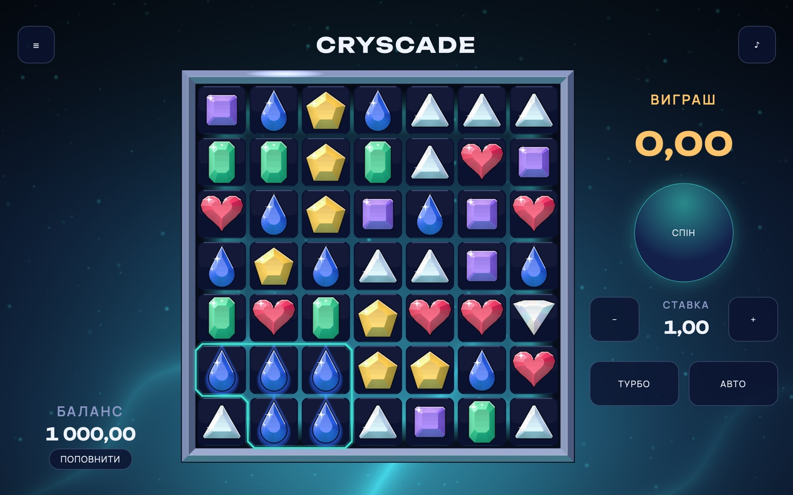
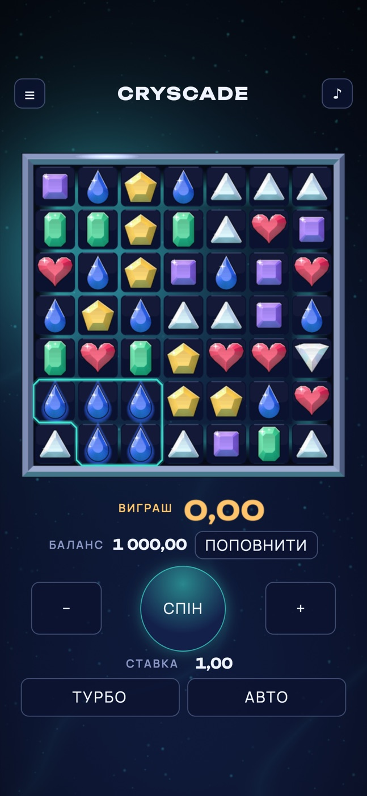
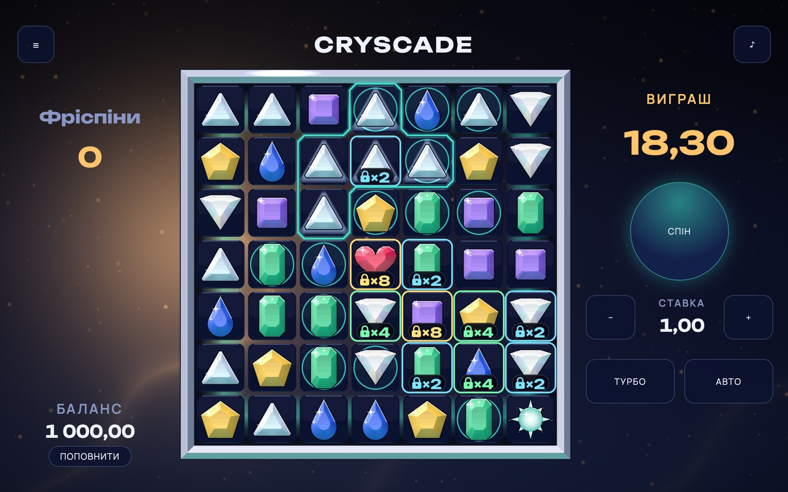
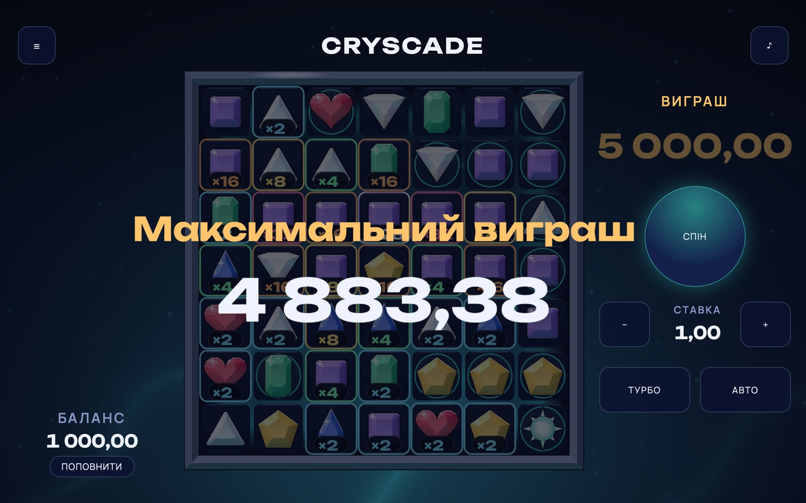
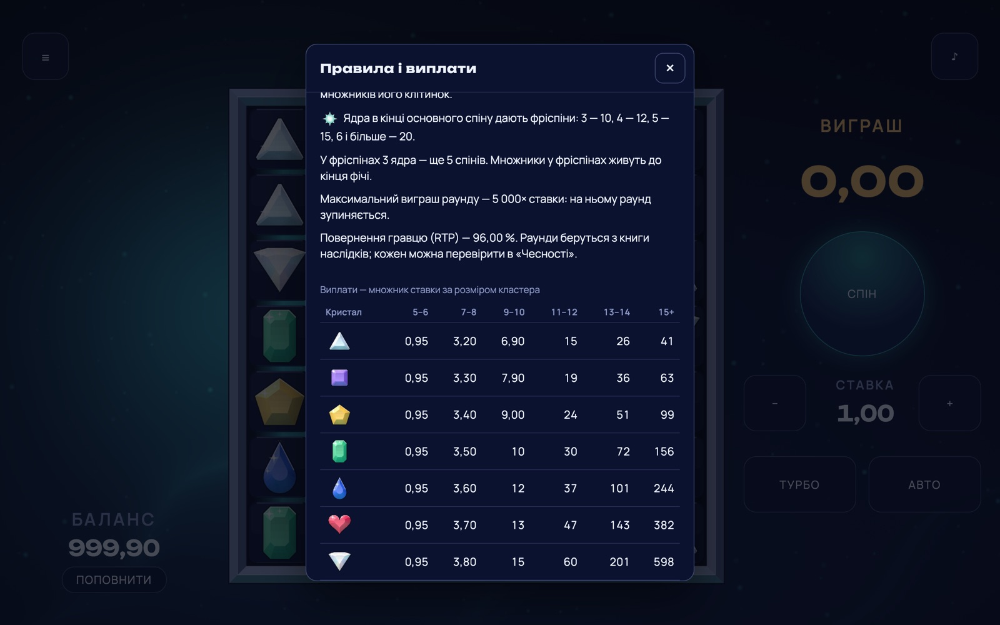

# Cryscade

[](https://github.com/Ingvvvar/cryscade/actions/workflows/ci.yml)

Каскадный слот на кристаллах: сетка 7×7, кластерные выплаты, точки множителей до ×128, фриспины с ретриггером, кап
5000× ставки. Портфельный проект клиента слотов — PixiJS v8 на WebGPU и WebGL, TypeScript, машина состояний,
сервер игры с версионированным протоколом, поведение из конфигурации, тесты и замеры.

**Только игровые кредиты.** Никаких реальных денег, платежей, депозитов, регистрации и ссылок на казино. Баланс
пополняется кнопкой «Поповнити». Это витрина инженерии, а не азартная игра.

**Играть:** https://ingvvvar.github.io/cryscade/ · **повтор максимального выигрыша (5000×):**
https://ingvvvar.github.io/cryscade/?replay=book:58353 — открывается в любом браузере, в чистом профиле, без игры и
без денег.

Стек: Vite 8, React 19, TypeScript 6 (strict), PixiJS 8.21, Vitest 5, fast-check, Playwright; npm, Node 24 в CI.



| | | |
|---|---|---|
|  |  |  |
| **Портрет** (WebGL) | **Фича** — фриспины: тёплый грот, замки на множителях | **Большой выигрыш** — кап 5000× (WebGPU) |



## Что здесь доказано, а не сказано

Шесть свойств, ради которых проект существует; у каждого — тест или замер.

1. **Сервер решает, клиент показывает.** Сервер игры (RGS) живёт в Web Worker и говорит с клиентом по протоколу
   `v: 1`. Клиент не импортирует генератор исходов — это держит тест графа импортов.
2. **RTP ровно 96.00%.** Исход выбирается по весам из заранее построенной книги раундов; RTP — точная сумма по книге в
   целых числах, а не оценка симуляцией.
3. **Проверяемая честность.** Выбор исхода — HMAC-SHA256 от секрета сервера (его SHA-256 опубликован до игры), сида
   игрока и номера раунда. Любой раунд истории перепроверяется и воспроизводится.
4. **Кадр — функция событий раунда и времени.** Презентация — расписание, которое читает чистая функция
   `sampleScene(schedule, t)`. Пропуск, турбо, пауза и восстановление посреди каскада после перезагрузки — просто
   другое `t`.
5. **Устойчивость.** Идемпотентные ставки, повтор после обрыва без двойного списания, восстановление незавершённого
   раунда, две вкладки на одном кошельке — всё это можно сломать руками в «Лабораторії мережі».
6. **Правила юрисдикции — данными.** Один билд, два пресета: обычный и строгий по модели требований UKGC. Код читает
   флаги пресета.

## Архитектура и её границы

```
 ui/ (React) ─► client/ GameController ─► RgsClient ─► транспорт ─► server/ RGS (Web Worker)
      ▲                  │                                              │
      │                  ▼                                              ▼
      │           core/fsm (переходы)                       RoundSource: книга | живой ГСЧ
      │                  │                                              │
      │                  ▼                                              ▼
      │    core/presentation: расписание ◄── события раунда ◄──── core/engine
      │                  │ sampleScene(t)
      └── render/ Pixi ◄─┘ SceneState (предвыделенные буферы)
```

- `core/` — чистый TypeScript без DOM: движок раунда, ГСЧ (xoshiro128** от splitmix32), модель и конфиг, машина
  состояний клиента, расписание показа, деньги. В нём нет `Math.random`, часов, `crypto` и DOM, а из `Math` в движке —
  только операции, которые IEEE 754 считает однозначно: книгу строит V8, а повтор может пересчитать JavaScriptCore.
- `server/` — логика RGS на портах (хранилище, замок, часы, энтропия, оповещения, криптография, загрузчик книги).
  Браузерные адаптеры — IndexedDB, Web Locks, BroadcastChannel, WebCrypto — только в `server/worker.ts`.
- `client/` — контроллер игры, клиент RGS с повторами, транспорт до воркера и лаборатория сети, часы показа.
- `render/` — раскладка, геометрия и свет кристаллов без Pixi; `render/pixi/` — атлас, сцена, шейдер фона. Рендер
  ничего не решает: тикер двигает часы показа и ставит их `SceneState` на сцену.
- `ui/` — React-оболочка (функциональные компоненты и хуки): панель, диалоги, i18n, монтирование сцены.
- `audio/` — синтез на WebAudio, ни одного звукового файла.

**Граница держится не договорённостью, а четырьмя проверками:** тест графа импортов (каждое ребро таблицы
модулей — литеральными «можно» и «нельзя»; из `client/`, `render/`, `ui/`, `audio/` не достижим ни один файл
`core/engine`, `core/rng`, `server/`), тест запрещённых глобалов в `core/` и `server/`, правила `no-restricted-*` в
линтере и типы по средам исполнения (`core/` и `protocol/` — без DOM, `server/` — WebWorker без DOM). Каждая проверка
доказана мутацией: протащенный запрещённый импорт или глобал ломает набор.

## Объектное устройство

Код игры объектный, React-оболочка — функции и хуки. Класс — там, где есть состояние, инвариант или полиморфная роль;
алгоритм без состояния — функция модуля. Приватное — `#`, зависимости — через конструктор, связывание — в корнях
композиции (`ui/main.tsx` и `server/worker.ts`), без синглтонов, без изменяемого состояния модулей и без DI-контейнеров.

| Паттерн | Где | Классы |
|---|---|---|
| State | машина состояний клиента | `BootingState`, `AuthenticatingState`, `IdleState`, `RequestingState`, `PresentingState`, `FeatureIntroState`, `EndingState`, `RestoringState`, `WaitingForTabState`, `RefillingState`, `ReplayingState`, `ErrorState` — переход `on(event) → { state, commands }` |
| Command | команды машины — данные | `callPlay`, `callEndRound`, `startPresentation`, `skipPresentation` и др.; исполняет `GameController` |
| Strategy | рекордер движка; источник раундов; источник символов | `EventRecorder`, `StatsRecorder`, `SilentRecorder`; `BookRoundSource`, `LiveRoundSource`; `RngSymbolSource`, сценарий теста |
| Decorator | транспорт и источник раундов | `NetworkLabTransport` над `WorkerTransport`; `WatchdogSource` над источником символов; `ForcedRoundSource` (dev и e2e) над источником раундов |
| Порты и адаптеры | сервер | `Storage`: `MemoryStorage`, `IndexedDbStorage`; `Lock`: `MemoryLock`, `WebLocksLock`; `Clock`, `Entropy`, `Broadcast`, `Crypto`, `BookLoader` |
| Repository | кошелёк, раунды, ключи, честность | `WalletRepository`, `RoundRepository`, `IdempotencyRepository`, `FairnessRepository`, `SecretRepository` |
| Facade | для `ui/` | `GameController`; `PixiRenderer` за интерфейсом `Renderer` |
| Observer | подписки | `useSyncExternalStore` на контроллер; звук — на часы показа (`Presenter.observe`); вкладки — `BroadcastTabChannel` |
| Builder | расписание раунда | `ScheduleBuilder` (`buildSchedule`) |
| Object Pool | горячий путь кадра | всё создано заранее по клетке: символы и подсветки (`GridView`, `HighlightView`), 147 частиц осколков (`ShardView` на `ParticleContainer`), плашки множителей (`SpotChips`), глифы чисел (`GlyphNumber`) — кадр их только переставляет |

Горячие пути — движок, `sampleScene`, кадр рендера — без объекта на клетку и на кадр: состояние в типизированных
массивах, дробное время тикера становится целыми миллисекундами в одном месте (`FrameClock`), потому что V8
упаковывает дробное число в кучу, когда оно идёт аргументом в невстроенную функцию. Ноль аллокаций `sampleScene`
держат AST-скан и замер 200 000 кадров без сборок молодого поколения.

## Почему книга, а не симуляция

Высокая волатильность делает Монте-Карло грубым: σ выигрыша — 14.8 ставки на раунд, и даже на 10⁷ раундов
99%-интервал RTP — **±1.21 процентного пункта** ([отчёт прообраза](docs/math-prototype.md); на 10⁸ — 95.773% ± 0.381%).
Поэтому исходы посчитаны заранее: 10⁸ раундов разложены по корзинам выплат, из каждой сохранено до 5000 с весом, и
сервер выбирает запись с вероятностью, пропорциональной весу. RTP игры — точная дробь по книге:

- 58 354 записи, 252 632 Б gzip, SHA-256 несжатой книги — золотой литерал теста;
- RTP = 627 328 007 163 525 / 653 466 674 128 700 = 95.999999999996%, отклонение −27/6.5·10¹⁴ — меньше 1e-9 (тест
  считает в `BigInt`);
- выигрыш — 30.17% раундов, выше ставки — 11.29%, фича — 1 на 204, кап — 1 на 898 298 ([отчёт по книге](docs/math.md)).

Раунд из книги — это сид: книга хранит сид, итог и вес, события восстанавливает движок. `npm run book:check`
пересобирает книгу и сверяет её побайтно.

## Честность и её пределы в браузере

Секрет сервера — 32 случайных байта; до игры показано его обязательство — SHA-256. Выбор раунда —
`HMAC-SHA256(секрет, "clientSeed:nonce:counter")`, первые 8 байт — `uint64`, значения у края отбрасываются (без
смещения по модулю), остаток по накопленным весам даёт индекс книги. Сид игрока можно сменить; смена раскрывает
прежний секрет, и тогда любой раунд истории перепроверяется в «Чесності» и воспроизводится ссылкой
`?replay=round:<id>`. Разобранный пример на настоящем раунде — openssl и Python по шагам, плюс
`node tools/fairness/verify.ts`: [docs/fairness.md](docs/fairness.md).

Пределы — честно. **Сервер здесь работает в вашем же браузере**, и секрет лежит на этом устройстве, в IndexedDB:
кто захочет, прочтёт его до раскрытия. Это демонстрация протокола: тот же протокол говорит с удалённым сервером, и
транспорт меняется одним адаптером. Повтор записи книги (`?replay=book:N`) от устройства не зависит — события раунда
в движке браузера побайтно равны посчитанным в Node; e2e сверяет все 58 354 записи в Chromium и WebKit.

## Пресеты юрисдикции

| Флаг | обычный | строгий (модель UKGC) |
|---|---|---|
| автоигра | да, с лимитами | нет |
| турбо | да | нет |
| пропуск показа | да | нет |
| минимальный цикл спина | 0 | 2500 мс |
| празднование выигрыша не больше ставки | да | нет |
| чистый результат и время сессии | в меню | всегда на экране |

Пресет — `?jurisdiction=strict` или «Налаштування». Код читает флаги пресета, а не его имя; правила действуют со
следующего раунда. Строгий пресет — модель правил, а не юридическая сертификация.

## Лаборатория сети: как сломать сеть руками

Меню ☰ → «Лабораторія мережі». Это тот же декоратор транспорта, что всегда стоит в цепочке; по умолчанию он прозрачен.

- **Задержка и разброс** — запросы доходят до сервера не раньше; игра ждёт, панель занята.
- **Потеря запросов и ответов**, в процентах — клиент повторяет тот же запрос с тем же ключом идемпотентности через
  250, 500, 1000 и 2000 мс; потерянный ответ на ставку не списывает её дважды: сервер узнаёт ключ и отдаёт тот же
  раунд.
- **«Загубити наступну відповідь»** — следующий ответ пропадёт; смотрите в «Історію»: один раунд, одно списание.
- **«Перезавантажити посеред наступного раунду»** — страница перезагрузится, как только сервер примет ставку; после
  перезагрузки показ продолжится с начала той группы, где оборвался, и раунд закроется.
- **«Затримати наступне завершення раунду»** / **«Відпустити затримане»** — раунд остаётся активным, пока вы не отпустите; откройте
  вторую вкладку — она увидит, что раунд держит другая, и предложит «Грати тут».
- Потеря всех запросов — экран «Сервер гри не відповідає», деньги не тронуты; перезагрузка — лаборатория снова чиста.

Две вкладки делят кошелёк: изменения — под Web Locks, запись — одной транзакцией IndexedDB с CAS по ревизии,
остальные вкладки узнают баланс через BroadcastChannel.

## Как проверяется

- **Юнит и property** (Vitest в Node, fast-check): движок — литеральные сценарии на ручных сетках, золотые хеши,
  тихий и записывающий режимы на 10 000 сидов дают один итог; деньги, книга, честность (HMAC сверен с RFC 4231 из
  скачанного файла и с `node:crypto`), протокол (мусор не роняет гарды), сервер на портах в памяти; кошелёк двух
  вкладок с потерями, дублями и перемежениями доставки — деньги сходятся до минимальной единицы после каждой записи;
  машина состояний — таблица на каждую пару «состояние — событие» и property против модели окружения; расписание —
  конец показа даёт ровно итоговую сетку, вспышек не больше трёх в секунду. Красный property на случайном сиде не
  перезапускается до зелёного: контрпример становится литеральным тестом.
- **E2E** (Playwright, 145 тестов): весь список §14 — в Chromium и WebKit: первый спин, перезагрузка посреди каскада,
  потеря ответа на ставку, две вкладки по 30 спинов, строгий пресет, повтор в чистом профиле, клавиатура, reduced
  motion. Пустая консоль — в каждом тесте: общая фикстура роняет тест с любым сообщением, кроме двух точных шаблонов
  среды без GPU. Только Chromium — то, что по природе только там (обход кнопок по Tab, дробные дельты кадра,
  headless shell без WebGPU).
- **GPU** (`npm run shots`, настоящий GPU, вне CI): снимки ключевых моментов на поддельных часах, draw-call с
  потолками-храповиком на WebGL и WebGPU, читаемость символов по пикселям (контраст 3:1 у каждого экземпляра на каждой
  подложке множителя), прогрев шейдеров и страниц глифов, тест наложения замка и цифр плашки.
- **Мутационное тестирование** (`npm run mutation`, StrykerJS): движок, машина состояний, расписание, логика сервера —
  96.1%, 100%, 93.8% и 96.8% по счёту Stryker, без эквивалентных мутантов — 100% в каждой области (до разбора выживших
  было 90.0%, 63.8%, 76.9% и 89.5%). Каждый выживший объяснён: эквивалентный — с причиной в
  `tools/mutation/equivalents.json`, пробел в тестах — новым тестом, код, который ничто не различает, — убран.
  Разбор нашёл и расхождение с IndexedDB: хранилище в памяти молча отдавало пустое на обратном диапазоне индекса.
- **Аудит** — тоже тестами, с положительными контролями: мёртвый код (файлы вне графа импортов от точек входа и
  экспорты без импортёров — оба списка пусты), холостые тесты (без проверок; с проверкой, которая не может упасть;
  skip, only, todo; проверка по набору, размер которого тест не проверил — на пустом наборе `every` и цикл молчат) и
  сторож «имя пресета не сравнивается». Аудит нашёл и убрал недостижимый класс пула, 163 лишних экспорта, сравнение
  имени пресета в настройках и 23 проверки по набору без размера.

Каждый защитный тест доказан мутацией: правка продакшен-кода, которую он обязан поймать, ломает набор — и откатывается.

## Как здесь обращаются с измерениями

- **Инструменту верят после положительного контроля.** Счётчик draw-call сначала ловит 48 разных текстур; замер
  времени кадра — 4 мс работы, подброшенных в каждый кадр; замер памяти — флаг утечки, который держит объект и текстуру
  на каждый раунд, а в воркере — свой объект: все три проверки обязаны покраснеть. Мутационный раннер Vitest на Vitest 5
  контроль не прошёл — заведомо смертельный мутант «выживал», к мутантам прикладывались единицы тестов, — поэтому
  мутации гоняет command runner.
- **Синтетический ввод — чтобы привести игру в состояние**, а не как предмет замера: путь ввода меряется кликом по
  координате с настоящим попаданием по слоям.
- **Производительность — только на GPU.** Тест печатает строку рендерера и отказывается считать на SwiftShader.
- **Худшее из N прогонов**, а не лучшее; стенд — не телефон.

Числа (`npm run measure` и `npm run shots`, Apple M4, 1440 × 900, DPR 2):

| Что | Бюджет | Замер |
|---|---|---|
| время кадра изнутри кадра, худшее из 5: покой / каскад / фича / большой выигрыш | — (телефон) | p95 0.6 / 1.0 / 0.9 / 0.6 мс (WebGL), 0.8 / 1.1 / 0.9 / 0.7 мс (WebGPU); кадров длиннее 16.7 мс — 0 |
| draw-call: покой / каскад / большой выигрыш | ≤ 15 / ≤ 25 / ≤ 35 | 4 / 6 / 4 на WebGL и WebGPU |
| память за 300 спинов: объекты кучи после сборки | ≤ +5% к 50-му спину | страница +1.2%, воркер ≈ 0%; живых текстур не прибавилось |
| начальный JS без книги, с воркером | ≤ 300 КБ gzip (307 200 Б) | 279 197 Б |
| книга исходов | ≤ 1 МБ gzip, лениво | 252 632 Б, после первого кадра |
| атлас | ≤ 2048×2048 | 2048 × 1024 |

Время кадра — это CPU-время кадра: от первого слушателя тикера до конца `render` Pixi. Оно ниже порога, на котором
стенд что-то различает; без подёргиваний ли игра на телефоне — проверяется на телефоне.

## Запуск

```bash
npm ci
npm run dev            # dev-сервер: http://localhost:5173/cryscade/
npm run typecheck      # tsc -b по всем средам исполнения
npm run lint           # ESLint, ноль предупреждений
npm test               # юнит и property, Node
npm run e2e            # Playwright: Chromium и WebKit (npx playwright install --with-deps chromium webkit)
npm run build          # прод-сборка; гейт бюджета роняет сборку сверх 300 КБ
npm run shots          # GPU: снимки, draw-call, читаемость — только локально, на настоящем GPU
npm run measure        # замеры §13: время кадра и память — только на настоящем GPU
npm run mutation       # StrykerJS по областям; в CI не входит
npm run math:quick     # золотая сумма выплат на 2·10⁵ раундов
npm run book:check     # пересборка книги исходов, побайтная сверка
```

Параметры адреса: `?renderer=webgl|webgpu` — принудительный рендерер (работает и в проде), `?jurisdiction=strict` —
строгий пресет, `?replay=book:<индекс>` и `?replay=round:<id>` — повтор раунда.
